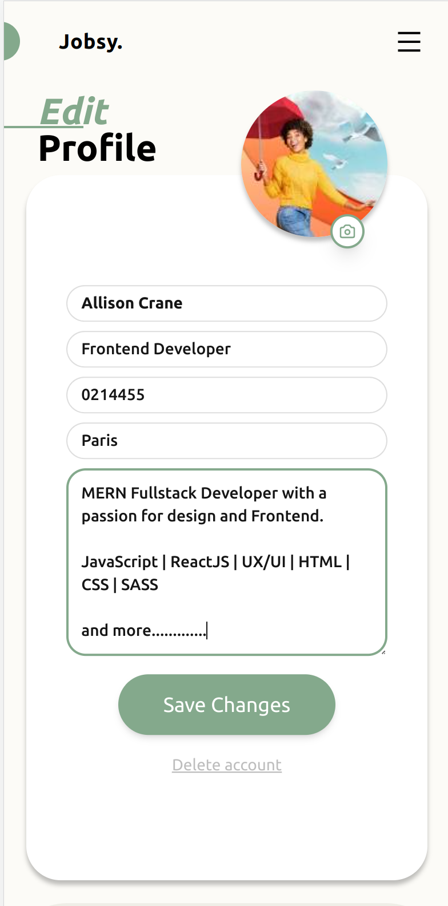
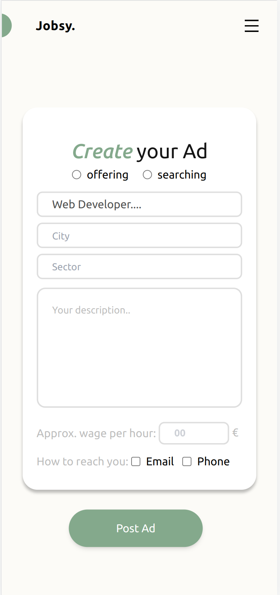
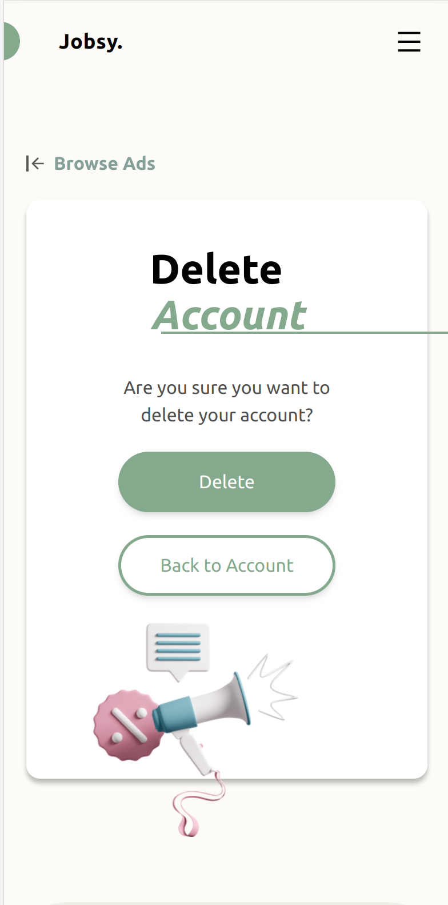

# Jobsy. - A Job Portal Website

 <br/>


**Jobsy.** is a modern, user-friendly job portal that connects job seekers with potential employers. The website is built with the latest technologies, including MERN Stack and is designed to be accessible to all. Whether you're looking for a new job or looking to hire, Jobsy makes the process simple and straightforward.
 <br/>
 <br/>
 This project marks our debut as developers, as well as our first team effort. Throughout the course of this project, we have honed our skills and learned a wealth of new technologies and problem-solving techniques. From the challenges we faced to the solutions we devised, this project has been a valuable learning experience that has prepared us for future projects and opportunities.
 <br/>

> Visit our website: [Jobsy Website](https://jobsy-jobportal.netlify.app)<br/> <br/>


## Table of Contents

1. [Project Status](#1-project-status)
2. [Features](#2-features)
3. [Technologies Used](#3-technologies-used)
4. [Screenshots](#4-screenshots)
5. [Room for Improvement](#5-room-for-improvement)
6. [Acknowledgements](#6-acknowledgements)
7. [Setup](#7-setup)
8. [Our Team](#8-out-team)

<br/>

## 1. Project Status

Project is: _in progress_ 
The project is currently in progress and actively being developed by a dedicated team of developers. We are continuously adding new features and fixing any bugs to ensure a seamless user experience.

This project is the final project of a one-year MERN Stack course by DCI, officially presented on 02.02.2023. 
<br/>

## 2. Features

## Jobsy provides several key features to both job seekers and employers. 

**For Not Logged In Users:**

- View advertisements without the need to log in
- Opportunity to Sign Up


**For Logged In Users:**

- Access advertisements and view the contact details of the publisher
- Send messages to the publisher of the advertisements
- Create and publish own advertisements (searching or offering)
- Manage a user profile, including the ability to provide contact information (email and/or phone), profession, and a brief description about themselves
- Edit their profile, including the ability to add a profile photo and update their "about" section
- Monitor and manage their own advertisements, including the ability to edit and delete them
- Delete their profile and all associated advertisements
 <br />


## 3. Technologies Used
Jobsy uses the latest technologies and tools to deliver a fast, secure, and user-friendly experience. Some of the key technologies used in the project include:

**Design:**
- Figma  [-> see design](https://www.figma.com/file/cmWtNE21nByCtTRUkoR2uS/Wireframing-DT?node-id=112%3A2815&t=uVB5Ez63DIcXSe0U-0)

**General:**
- Node.js (v18.12.1)


**Frontend:**
- React (^18.2.0)
- TypeScript (4.9.3)
- Vite (4.0.0)
- Tailwind (3.2.4)
- Axios (1.2.1)
- Quill Rich Text Editor (^1.3.6)
- Emoji Picker React (^4.4.7)
- Framer Motion (8.0.1)
- React Tostify (^9.1.1)


**Backend**
- Express (^4.18.2)
- Mongoose (^6.8.0)
- Eslint (^8.29.0)
- bcrypt (^5.1.0)
- jswebtoken (^8.5.1)
- Cloudinary (^1.33.0)
- Socket.io (^4.5.4)


**Data base:**
- MongoDB


**Deployment:**
- Frontend: Netlify
- Backend: Render


## 4. Screenshots

**Mobile First** <br>






**Desktop** <br>


## 6. Room for Improvement

 Improvements for future development:

- [ ] Add new feature for user to network each other
- [ ] Add new feature for user to manage ads created by other users in his/her account. eg. save and categorize ads (favorits, contacting)
- [ ] Infinitive scroll in Mobile Version when browsing ads.

To do:

- Add 'partner' in user model to manage connected contacts
- Add related routes with partner in backend like `/user/partners`, `/user/add-partners` or `/user/delete-partners`

## 8. Acknowledgements

- This is the final project of one year MERN Stack Course by Digital Career Institute.
- This project was inspired by LinkedIn, makes communication as easy as possible with direct messeges.
- Many thanks to our teachers Christoph Muck, Jan Laskowski, Manuel Jung and whole DCI Team. 

## 7. Setup

To run this project, install it locally using npm:

```
$ git clone git@github.com:dimilidi/jobportal.git
$ cd backend
$ npm install
$ npm run dev
$ cd ../frontend
$ npm install
$ npm run dev
```


## 8. Our Team: 
Jobsy is developed and maintained by a team of dedicated developers with a passion for building great products. Our team is constantly working to improve and enhance the website to provide the best experience for users.


1. :woman_mechanic: **Miki Gerlach** (Backend, Frontend) [LinkedIn](https://www.linkedin.com/in/mikigerlach/)
2. :ninja: **Lidiya Dimitrova** (Backend, Frontend) [LinkedIn](https://www.linkedin.com/in/dimitrovalidiya/)
5. :sunglasses: **Timon Hosch** (Backend, Frontend) [LinkedIn](https://www.linkedin.com/in/timon-hosch-3a1463236/)
3. :cartwheeling: **Paulina Hryszko** (Design, Frontend) [LinkedIn](https://www.linkedin.com/in/paulina-hryszko/)
4. :lotus_position_woman: **Oriana Quintero** (Design, Frontend) [LinkedIn](https://www.linkedin.com/in/oriana-quintero/)


Images credits to: https://icons8.com/illustrations 

